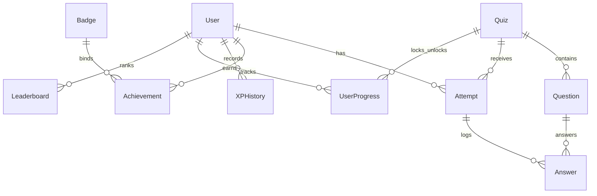

# 🧠 MindQuest: The Developer Guide & Project Handbook

Welcome to the **MindQuest Developer Guide**. This document is designed to give you complete technical and product mastery over the application. After reading this, you will have the knowledge required to answer any question about the platform—whether asked by a software architect, a database administrator, or a non-technical product manager.

---

## 📂 Table of Contents
1. **Executive Product Summary** (Non-Technical Pitch)
2. **Core Technology Stack & Architecture Rationale**
3. **Database Schema & Relational Design**
4. **Step-by-Step Implementation Chronicle**
5. **Directory Map & Key Files Breakdown**
6. **Technical Interview FAQ** (For Developers/Architects)
7. **Product & Business FAQ** (For PMs/Stakeholders)

---

## 1. Executive Product Summary (Non-Technical)

### What is MindQuest?
MindQuest is a gamified learning platform modeled after modern, high-engagement systems like Duolingo. It replaces dry, text-based quizzes with an interactive, progression-oriented curriculum.

### Key Value Propositions:
* **The Progression Loop**: Instead of choice-fatigue, users are guided on a linear, step-by-step learning path. 
* **The Psychology of Streaks**: Daily engagement fire/streak tracking leverages loss aversion; players return to the app to protect their consecutive days counter.
* **Micro-Rewards**: Real-time XP accumulation, level progression, and collectible badges provide instant gratification.

---

## 2. Core Technology Stack & Architecture Rationale

| Technology | Role | Why We Selected It |
| :--- | :--- | :--- |
| **Next.js 15 (App Router)** | Full-stack framework | Combines React Server Components (RSC) for rapid initial page loads with secure Server Actions, eliminating the need for a separate backend API server. |
| **TypeScript** | Type Safety | Enforces strict compile-time types across database operations, API parameters, and React components, reducing runtime bugs. |
| **PostgreSQL (Neon Cloud)** | Relational Database | Relational structure is perfect for complex statistics (streaks, leaderboard aggregation, levels). Neon offers cloud hosting with serverless autoscaling. |
| **Prisma ORM (v7)** | Database Client | Simplifies PostgreSQL queries with auto-generated TypeScript clients. Separates runtime adapters (using `pg` pools) from CLI execution. |
| **Framer Motion** | UI Animations | Drives the visual physics of the app—bouncy path nodes, sliding drawer feedback overlays, and level-up milestones. |
| **Jose (Edge JWT)** | Authentication Security | Encodes and verifies user session tokens in lightweight edge runtimes, allowing middleware redirects in milliseconds. |
| **Nodemailer** | OTP Mailer | Connects directly to secure SMTP mail pools to deliver 6-digit numeric login codes directly to users. |

---

## 3. Database Schema & Relational Design

The database is built on **Neon Cloud PostgreSQL** and mapped through **Prisma ORM**. Here is how the tables interact:



### Table Definitions & Mechanics:

1. **`User`**: The central actor. Tracks profile statistics (`email`, `name`, `avatarUrl`, `bio`, `role`), progress metrics (`level`, `totalXp`, `currentStreak`), and activity history (`lastActiveDate`).
2. **`OTP`**: Short-lived (10-minute expiry) 6-digit verification codes linked to user emails for passwordless logins.
3. **`Quiz`**: Represents a learning node. Has metadata (`title`, `difficulty`, `xpReward`) and a unique index `sequenceOrder` which governs its linear position on the map.
4. **`Question`**: Belongs to a single `Quiz`. Supports both single-select and multi-select checks. Has `correct` values (indices of correct options) and an `xpReward`.
5. **`Attempt`**: Logs a user's quiz run, recording their duration, percentage score, and total XP earned.
6. **`Answer`**: Detailed answer log mapping what options the user chose for every question during an `Attempt`, and whether they got it correct.
7. **`Badge`**: Immutable achievement templates defined by rules (`FIRST_QUIZ`, `STREAK_7`, etc.) and metric thresholds.
8. **`Achievement`**: A bridge table mapping which `Badge` has been unlocked by which `User` and when.
9. **`XPHistory`**: Audit trail records of all XP events (`QUIZ_COMPLETED`, `STREAK_BONUS`, `ADMIN`), used to compile activity statistics.
10. **`UserProgress`**: Manages path locking. Combines `userId` and `quizId` to log if a node is `unlocked` or `completed`.

---

## 4. Step-by-Step Implementation Chronicle

Here is how the project was built from scratch:

```
[Phase 1: Database] ────> [Phase 2: Edge Auth] ────> [Phase 3: Quiz Engine] ────> [Phase 4: Gamification] ────> [Phase 5: Deploy]
```

### Phase 1: Database Setup & Prisma Configuration
1. Scaffolded Next.js 15 App Router using TypeScript.
2. Initialized Prisma. Under Prisma 7, connection URLs are separated: the schema uses standard models while [prisma.config.ts](file:///c:/Users/harsh/Quiz_app/prisma.config.ts) handles environment variables.
3. Implemented [prisma.ts](file:///c:/Users/harsh/Quiz_app/src/lib/prisma.ts) wrapping Prisma client inside a `PrismaPg` adapter using `pg.Pool` for connection pooling.

### Phase 2: Edge Middleware & Authentication Setup
1. Created passwordless email verification. When a user submits their email, the server generates a 6-digit code, hashes it in the `OTP` table, and delivers it via SMTP.
2. Verified OTPs on submission. Upon success, a stateless JWT is signed using `jose` and injected into secure `httpOnly` cookies.
3. Set up `middleware.ts` to inspect the JWT cookie. Unauthenticated requests redirect to `/login`. Admin pages (`/admin/*`) redirect standard users to `/dashboard`, and admins accessing standard user paths are redirected to `/admin`.

### Phase 3: Path Map & Interactive Quiz Console
1. Built the learning path. Uses custom SVG calculations to draw responsive, alternating lines connecting the quiz nodes.
2. Developed the quiz console. The state machine tracks current indexes, correct logs, and selection arrays.
3. Designed the bottom validation drawer. Bounces upward using Framer Motion, flashing green for correct options and red (with detailed correct indices) for mistakes.

### Phase 4: Gamification & Profile Systems
1. Wrote the streak algorithm. When a quiz is submitted, the server compares the user's `lastActiveDate` to local server midnights. If it is the consecutive calendar day, the streak increments. If same-day, it stays. If older, it resets.
2. Added automatic badge checks. If metrics criteria are met on quiz submission, achievements are registered.
3. Built the custom avatar selector. Generated 8 cute cartoon avatars using the AI tool and placed them in `public/avatars/`. Added a Base64 system photo uploader with client size validation (<1.5MB).

### Phase 5: Production Compilation & Cloud Deployments
1. Solved Next.js build-time errors by updating the build script to run `prisma generate` before `next build`.
2. Appended `force-dynamic` directives to dynamic server layouts/pages to ensure the Next.js compiler doesn't attempt database connections during compile-time.

---

## 5. Directory Map & Key Files Breakdown

* **[src/middleware.ts](file:///c:/Users/harsh/Quiz_app/src/middleware.ts)**: Intercepts requests at the routing boundary. Decodes JWT sessions.
* **[src/app/actions/auth.ts](file:///c:/Users/harsh/Quiz_app/src/app/actions/auth.ts)**: Handles session lifecycles, admin passkey checks (`999999999`), Nodemailer SMTP deliveries, and dev fallback console loggers.
* **[src/app/actions/quizzes.ts](file:///c:/Users/harsh/Quiz_app/src/app/actions/quizzes.ts)**: Contains the core quiz grading algorithm, streak updates, badge checks, and path unlocking logic.
* **[src/app/profile/ProfileClient.tsx](file:///c:/Users/harsh/Quiz_app/src/app/profile/ProfileClient.tsx)**: Displays credentials. Hosts the system file selector (Base64 file reader) and the 8 pre-generated vector avatar buttons.
* **[src/app/path/page.tsx](file:///c:/Users/harsh/Quiz_app/src/app/path/page.tsx)**: Layout file rendering the visual SVG node path connectors.

---

## 6. Technical Interview FAQ (For Technical Audiences)

### Q: Why did you choose Next.js Server Actions over standard REST API routes?
> [!NOTE]
> Server Actions integrate natively with Next.js App Router forms. They are type-safe, eliminate the boilerplate of writing distinct fetch requests, and execute securely on the server, keeping database access credentials safe from the client bundle.

### Q: How does the authentication system secure routes without degrading page load speeds?
> [!NOTE]
> We use stateless JWT sessions stored in `httpOnly` cookies. Validation is handled by Next.js Edge Middleware using the `jose` library. Because middleware executes in lightweight Edge edge nodes before static pages are rendered, routes are protected instantly without waiting for database operations.

### Q: What strategy was used for user photo uploads without using AWS S3?
> [!NOTE]
> On the client side, we use a `FileReader` inside [ProfileClient.tsx](file:///c:/Users/harsh/Quiz_app/src/app/profile/ProfileClient.tsx) to read selected images as Base64-encoded Data URLs. The client validates that the file is less than 1.5MB to maintain performance, and the string is saved directly to the PostgreSQL `avatarUrl` text field. This provides self-contained uploads with zero cloud storage dependencies.

### Q: How does your database client configuration prevent connection exhaustion when scaling?
> [!NOTE]
> We use a global singleton pattern inside [prisma.ts](file:///c:/Users/harsh/Quiz_app/src/lib/prisma.ts) for local development to prevent database connection limits from being exceeded during hot reloads. In production, we instantiate the Prisma Client with a driver adapter wrapping `pg.Pool`, managing pool connections efficiently across serverless functions.

### Q: Why are your dynamic pages marked with `force-dynamic`?
> [!NOTE]
> During compilation (`next build`), Next.js attempts to pre-render pages statically. Since our dashboard, profile, and admin layout files call dynamic functions like `cookies()` or make database queries, compilation would fail on Vercel without a database connection. Marking them with `export const dynamic = 'force-dynamic'` instructs the builder to compile them as dynamic routes.

---

## 7. Product & Business FAQ (For Non-Technical Audiences)

### Q: How does the system drive user retention?
> [!TIP]
> Through the **streak retention loop**. By tracking consecutive activity days, we tap into a psychological concept called loss aversion. Once a user builds a 5 or 10-day streak, they are highly motivated to return daily to avoid losing that streak progress.

### Q: What is the benefit of the linear learning path over a list of quizzes?
> [!TIP]
> A list of quizzes often leads to choice overload. By structuring modules linearly as bouncing nodes, we provide a clear roadmap. Restricting access to node $N+1$ until node $N$ is passed with $\ge 80\%$ accuracy ensures users build necessary foundational skills first.

### Q: How do levels and XP scale?
> [!TIP]
> Levels progress linearly on a fixed 150 XP threshold. This ensures a clear sense of progress early on, while XP rewards for quiz completions and consecutive streak bonuses keep users engaged as they level up.

### Q: Can this platform scale to support commercial use cases?
> [!TIP]
> Yes. By decoupling database instances, using Neon Cloud for autoscaling PostgreSQL resources, and utilizing Edge middleware routing, the platform is structured to scale cleanly as user demand grows.
